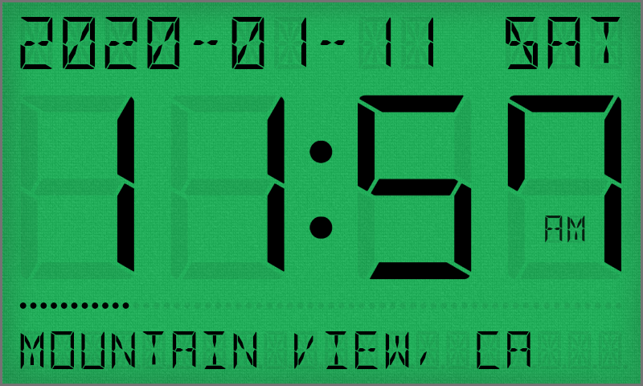

# New Old School LCD Clock

This is a modern riff on an old school LCD style clock.

Don't let the old school look fool you. There are some carefully crafted visual design elements at play here as well as some very crafty code that's worth a look!! Enjoy!!

This clock will appeal to those who appreciate the accessibility features or enjoy the realistic look of an old school LCD display in combination with the cool new features of a smart clock device. This clock would not be appropriate for those with attention deficit disorders because there are several forms of motion being used.

See it running on the web:
https://raycardillo.github.io/flutter_clocks/new_old_school_clock/#/

-----

## Visual Design Features
Careful attention was paid to several visual design elements.

- Realistic looking segmented LCD display components and time dominates the display.
- Realistic looking background LCD panel texture and grunge border.
- An LCD marquee displays fun messages on the bottom of the display.
- Seconds are displayed using LCD style dots that also establishes a divider before the marquee.
- Time period is displayed inside the last digit but is muted so it doesn't detract from the time display.
- All ClockModel properties are displayed but the time dominates the display.

## Accessibility Design Features
A major design goal was to help users with vision challenges.

- Large fonts make it easy to read the time from longer distances.
  - Font is clear, easy to read, and spaced well.
- High contrast to help those with color and vision problems.
  - Light mode contrast ratio is approximately **15:1**.
  - Dark mode contrast ratio is approximately **10:1**.
- Semantics are enabled so the clock could be used by screen readers.
  - All display elements have Semantics.
  - Semantics values are optimized for screen readers.
  - Marquee entries also include Semantics.

## Source Code Features
There are some neat tricks included and some classes that may be useful.

- Custom Layout
  - [Stack](https://api.flutter.dev/flutter/widgets/Stack-class.html) is used in combination with a few other widgets to overlay components for a custom responsive layout that also works on the Web platform.
  - [Opacity](https://api.flutter.dev/flutter/widgets/Opacity-class.html) is used in several ways (the widget as well as some [Color](https://api.flutter.dev/flutter/dart-ui/Color-class.html) definitions to achieve realistic effects.
- [LCDMarqueeWidget](./lib/src/lcd_marquee.dart) - Displays messages on an LCD marquee board with Semantics support.
  - Uses a `Stream<String>.period()` to update the marquee.
  - All entries displayed have `Semantics` for better accessibility support.
- [FunTimeMessage](./lib/src/fun_message.dart) - Obtains a fun message based on different time periods of the day.
  - Demonstrates logic to determine the "time period" (e.g., morning, afternoon, night).
  - Demonstrates a technique to cycle through a list of messages based on a counter modulus.
